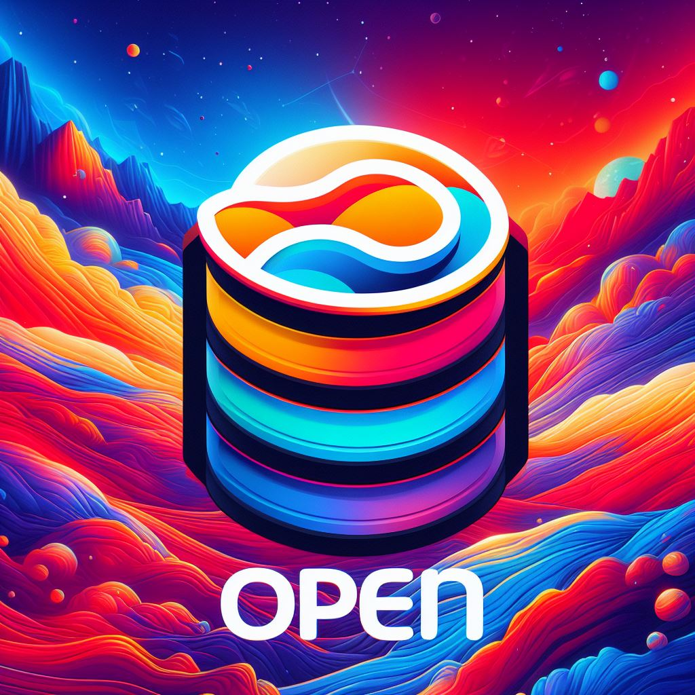

# Open Server 🚀



## Table of Contents

- [Open Server 🚀](#open-server-)
  - [Table of Contents](#table-of-contents)
  - [Overview 📖](#overview-)
  - [Updates ✨🧨](#updates-)
  - [Roadmap 🗺️](#roadmap-️)
    - [How to Install \& Run ⚙️](#how-to-install--run-️)
    - [Features ✨](#features-)
  - [Server Configurations 🛠️](#server-configurations-️)
      - [All configs are stored in  `configs/`  folder.](#all-configs-are-stored-in--configs--folder)
    - [Settings and API Keys](#settings-and-api-keys)
    - [Models Configs](#models-configs)
  - [Supported Provider](#supported-provider)
    - [Completions and Chat Models](#completions-and-chat-models)
    - [Image Models](#image-models)
    - [Embeddings](#embeddings)
    - [Vector Databases](#vector-databases)
  - [Contributing](#contributing)

## Overview 📖

Open Server is my attempt to recreate an **OpenAI Compatible Server** for generating text, images, embeddings, and storing them in vector databases. It also includes a chat functionality. 

The server's request and responses are very similar to OpenAI's API with additional fields needed for different providers. It uses **Langchain** for the LLM part (Robust and powerful with callbacks) and provider SDKs for image generation and more.

## Updates ✨🧨

- 9 December 2023 : Added **OpenRouter** and **NeuroAPI** to providers as config based on OpenAI provider. Added cost calculation to config and routes in usage.

## Roadmap 🗺️

- [ ] Python SDK
- [ ] Docker Compose
- [ ] ( **Soon** ) Example Next.JS Front working with Open Server
- [ ] Monitoring for LLM generation (LLM Monitor & Prompt Layer)
- [ ] ( **Soon** ) Audio Translation & Generation & Transcription APIs (Local with Whisper, ElevenLabs)

### How to Install & Run ⚙️

To install the required packages:
```
pip install -r requirements.txt
```

To run the server:
```
python -m openserver.main
```

**Note**: For GPU support, you need to manually install **pytorch** and **llama-cpp-python**, based on your GPU type (CUDA & ROCM).

### Features ✨

This section lists the key features implemented in Open Server:

-   #### Chat & Completions 💬
    -   Streaming
    -   Function Calling
    
-   #### Image 
    -   Text-to-Image 


## Server Configurations 🛠️


#### All configs are stored in  `configs/`  folder.


###  Settings and API Keys

This file is used to store API keys, URLs, and other similar information. It has a YAML structure and can be used to configure various aspects of the server.

Example `config.yaml`:
```yaml
OPENAI_API_KEY: YOUR_OPEN_API_KEY
PALM_API_KEY: YOUR_PALM_API_KEY

DB_NAME: test
DB_HOST: localhost
DB_USERNAME: admin
DB_PASSWORD: admin

# Add more configuration options as needed...
```

### Models Configs

These configurations are stored in separate files for better organization and modularity. Each config file follows the YAML structure.

Example LLM Config (`llm_config.yaml`):
```yaml
chat_providers:
  palm:
    name: palm
    models: 
      - "models/text-bison-001"
    available: true
    
# Add more LLM configs as needed...
```

Example Image Config (`image_config.yaml`):
```yaml
image_models:
  novita:
    name: novita
    models:
      - "dynavisionXLAllInOneStylized_release0534bakedvae_129001.safetensors"
    available: true
    api_key: true
    api_key_name: NOVITA_API_KEY

# Add more image configs as needed...
```

Example Prompt Config (`prompts_config.yaml`):
```yaml
prompts:
  function_call:
    name: "function_call"
    file: "/prompts/function_call.txt"

# Add more prompt configs as needed...
```

Example Vector Database Config (`vectordb_config.yaml`):
```yaml
embeddings:
  cohere:
    name: cohere
    models: 
      - "embed-english-light-v2.0"
      - "embed-english-v2.0"
    available: true
    api_key: true

vectordbs:

  chromadb:
    available: true
   
# Add more vector database configs as needed...
```

Feel free to modify and extend these configurations according to your specific needs.

## Supported Provider

### Completions and Chat Models 

|   |     Provider     |   Completion  |      Chat     | Function Calling |   Streaming   |   |
|:-:|:----------------:|:-------------:|:-------------:|:----------------:|:-------------:|:-:|
|   |   -------------  | ------------- | ------------- |   -------------  | ------------- |   |
|   |      openai      |       ✅       |       ✅       |         ✅        |       ✅       |   |
|   |      cohere      |       ✅       |       ✅       |                  |       ✅       |   |
|   |    huggingface   |       ✅       |               |                  |       ✅       |   |
|   |    together-ai   |       ✅       |       ✅       |        ✅*        |       ✅       |   |
|   |    google-palm   |       ✅       |       ✅       |         ✅        |       ✅       |   |
|   |       ai21       |       ✅       |               |         ✅        |       ✅       |   |
|   |     fireworks    |       ✅       |       ✅       |        ✅*        |       ✅       |   |
|   | llama-cpp-python |       ✅       |               |         ✅        |       ✅       |   |

* **Some models** of provider support Function Calling.

### Image Models

|   |    Provider   |    Txt2Img    |    Img2Img    |    Upscale    |   |
|:-:|:-------------:|:-------------:|:-------------:|:-------------:|:-:|
|   | ------------- | ------------- | ------------- | ------------- |   |
|   |     openai    |       ✅       |       ✅       |               |   |
|   |  together-ai  |       ✅       |               |               |   |
|   |     novita    |       ✅       |       ✅       |       ✅       |   |
|   |    segmind    |       ✅       |       ✅       |               |   |

### Embeddings

palm, huggingface, openai, gradient, cohere


### Vector Databases

chromadb, lancedb, milvus, pinecone, qdrant,redis, weaviate

## Contributing
To contribute: Clone the repo locally -> Make a change -> Submit a PR with the change. 

Here's how to modify the repo locally: 
Step 1: Clone the repo 
```
git clone https://github.com/mj23978/openserver.git
```

Step 2: Navigate into the project, and install dependencies: 
```
cd openserver
pip install -r requirements.txt
```

Step 3: Submit a PR with your changes! 🚀
- push your fork to your GitHub repo 
- submit a PR from there 

